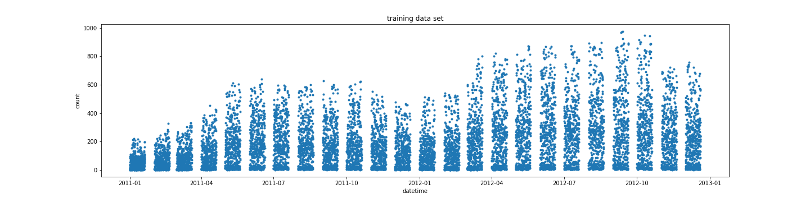
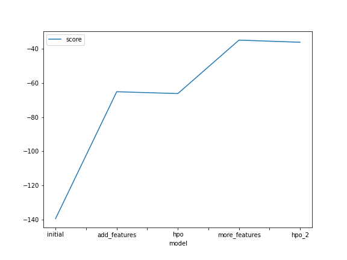
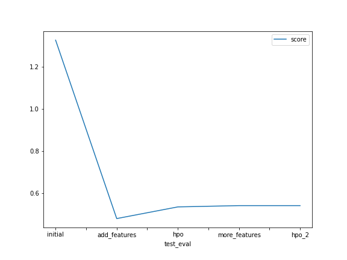

# Report: Predict Bike Sharing Demand with AutoGluon Solution
#### Ashutosh A. Patwardhan

## Initial Training
### What did you realize when you tried to submit your predictions? What changes were needed to the output of the predictor to submit your results?
Kaggle did not accept negative predictions. Negative predictions, if any, had to be replaced with zeros in order for Kaggle to accept the submission.

### What was the top ranked model that performed?
The top ranked model was a `WeightedEnsemble_L3` model fit after:

  1. Converting `season` and `weather` to categorical variables, and
  2. Adding `hour` as a categorical feature variable. 
    
Interestingly, additional feature engineering (beyond that described above) improved the validation score but reducedd Kaggle's test score, which means that the additional features led to overfitting.

## Exploratory data analysis and feature creation
### What did the exploratory analysis find and how did you add additional features?
Exploratory data analysis showed that:

  1. Variables in the `train` and `test` data sets were similarly distributed. This was not going to cause problems with modeling, with the exception described below;
  2. The exception was that the `test` data occurred at the end of the month whereas `train` data were from the beginning of the month. The training would not capture changes in customer spending habits, if any, that occurred at the end of the month;
  3. `season` and `weather` were initially read as integers from the `.csv` file. It made more sense for them to be used as categorical variables;
  4. It also made sense for `hour` to be made a feature variable, as `count` showed definite cyclicality according to time of day.

### How much better did your model preform after adding additional features and why do you think that is?
After including the additional features (`hour`, `weather` and `season`), the model validation score (root mead ssquared error) improved from -139.31 to -65.14, while the Kaggle score of the test data predictions improved from 1.32583 to 0.47842. This was primarily because `weather` and `season` were changed to categorical variables. For example, `season`=1 and `season`=2 just means that the two seasons are different. It does not imply that one season is "better than" or "greater than" the other. Same for weather.

As additional work, I added `year`, `month` and `dayofweek` as features. This improved the training and validation fit, but worsened the Kaggle score, indicating that the model was overfitted.

## Hyper parameter tuning
### How much better did your model preform after trying different hyper parameters?
Hyperparameter tuning did not have any significant impact on model performance. This bears out the [advice](https://auto.gluon.ai/dev/tutorials/tabular_prediction/tabular-kaggle.html?highlight=hyperparameter_tune_kwargs) to focus on feature-engineering and just specifying presets = 'best_quality' rather than tuning the hyperparameters.

### If you were given more time with this dataset, where do you think you would spend more time?
It would be best to spend more time on trying out more features:

  1. There is a upward trend of rentals over time. This cannot be ascribed to weather, but is probably owing to growing popularity of bike rentals. Including time as a feature may improve the model; 
  2. The previous day's `count` is probably an excellent predictor f the next day's `count`. It could be worthwhile making the previous day's `count` into a feature;
  3. Since a time series is involved, an RNN-based model may give better performance;
  4. It would also be interesting to replace the root-mean-squared-error evaluation metric by the root-mean-squared-logarithmic-error used by Kaggle.

### Create a table with the models you ran, the hyperparameters modified, and the kaggle score.
|model|num_trials|searcher|time_limit|score|
|--|--|--|--|--|
|initial|default|auto|600|1.32583|
|add_features|default|auto|600|0.47842|
|hpo_2|10|random|900|0.53994|

### Create a line plot showing the top model score for the three (or more) training runs during the project.

### Create a line plot showing the top kaggle score for the three (or more) prediction submissions during the project.

## Summary
  1. AWS SageMaker and the Autogluon package provide a powerful way to develop machine learning models;
  2. The burden of trying out and tuning a number of different model types is removed from the user;
  3. The user is allowed to focus on feature engineering, thus bringing the user's domain knowledge to be used to maximum effect;
  4. The problem of overfitting resulting from adding too many features was illustrated.
